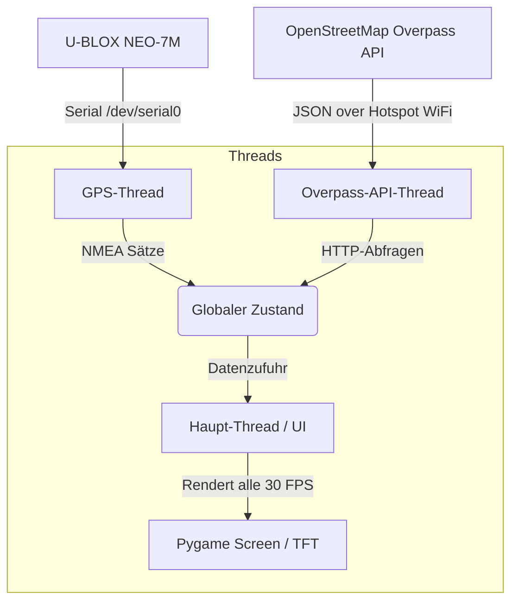

# Evans Co-Pilot Dashboard 🚗💨

> Ein interaktives, kindgerechtes Auto-Co-Pilot-Dashboard für den Raspberry Pi Zero WH, das aktuelle Geschwindigkeiten und Geschwindigkeitsbegrenzungen (via OpenStreetMap) visualisiert.

Dieses Projekt entstand für **Evan (geb. Juni 2021)**, um seine Faszination für Geschwindigkeiten und Tempolimits beim Autofahren spielerisch zu begleiten und die ständigen Fragen ("Wie schnell dürfen wir hier fahren?", "Wie schnell fahren wir gerade?") visuell und kindgerecht zu beantworten.

---

## 🌟 Features

*   **Große Live-Geschwindigkeit:** Gut lesbare Geschwindigkeitsanzeige im Zentrum des Displays mit dynamischem farblichem Feedback:
    *   🟢 **Grün:** Geschwindigkeit liegt im zulässigen Bereich.
    *   🟡 **Gelb:** Geringe Überschreitung (1-3 km/h über Limit).
    *   🔴 **Rot:** Überschreitung um mehr als 3 km/h.
*   **Tempolimit-Anzeige:** Klassisches europäisches Verkehrsschild (weißer Kreis mit rotem Rand), das das aktuelle Tempolimit anzeigt.
*   **Intelligente Straßenerkennung:** Übersetzung von OpenStreetMap-Typen in kindgerechte Begriffe (z.B. *Autobahn*, *Schnellstraße*, *Landstraße*, *Spielstraße*).
*   **Zusatzanzeigen für kleine Forscher:**
    *   🛰️ **Satelliten-Verbindung:** Live-Anzahl der verbundenen Satelliten ("Sats: 8").
    *   🏔️ **Höhenmesser & Himmelsrichtung:** Aktuelle Höhe über dem Meeresspiegel (ideal für hügelige Landschaften) und die Himmelsrichtung (N, S, O, W).
*   **Volle Autonomie:** Startet extrem schnell und vollautomatisch direkt nach dem Booten (Headless, direkt in den Framebuffer).

---

## 🛠️ Hardware-Architektur

Das System läuft auf sehr kompakter, robuster Hardware und lässt sich ideal im Fond eines Autos (z.B. VW Passat) montieren:

*   **Zentraleinheit:** Raspberry Pi Zero WH (mit aufgelöteten GPIO-Pins).
*   **Display:** Offizielles [Adafruit 3.5" PiTFT](https://www.adafruit.com/product/2097) (320x480 Pixel, TFT-Treiber `HX8357D`).
*   **GPS-Empfänger:** U-BLOX NEO-7M GPS-Modul, angeschlossen über die serielle GPIO-Schnittstelle (`/dev/serial0`).
*   **Stromversorgung:** 5V USB-Stromversorgung über das Bordnetz des Fahrzeugs.

### Verkabelung des GPS-Moduls (U-BLOX NEO-7M)
Das GPS-Modul wird über den 40-Pin-Header des Raspberry Pi angeschlossen. Da das Adafruit PiTFT-Display die GPIOs 18, 19, 21, 22, 23, 24, 25 für SPI und Touch nutzt, bleiben die seriellen UART-Pins für das GPS-Modul frei:

| U-BLOX NEO-7M Pin | Raspberry Pi Pin | GPIO Name | Funktion |
| :--- | :--- | :--- | :--- |
| **VCC** | Pin 2 (oder 4) | 5V Power | Stromversorgung (5V) |
| **GND** | Pin 6 (oder 9, 14, 20) | Ground | Masse |
| **TX** | Pin 10 | GPIO 15 (RXD0) | Empfangskanal des Pi |
| **RX** | Pin 8 | GPIO 14 (TXD0) | Sendeleitung des Pi |

---

## 🏗️ Software-Architektur & Datenfluss

Die Applikation läuft unter **Raspberry Pi OS** (Debian Bookworm/Trixie) und ist vollständig in Python geschrieben. Sie nutzt Multithreading, um blockierungsfreie Updates zu garantieren:



1.  **GPS-Thread (`src/gps_reader.py`):** Liest kontinuierlich mit `pyserial` und `pynmea2` die seriellen NMEA-Sätze (`$GPRMC` und `$GPGGA`) des GPS-Empfängers aus und aktualisiert Geschwindigkeit, Position, Höhe und Satellitenzahl.
2.  **API-Thread (`src/osm_api.py`):** Sendet alle 10 Sekunden die aktuelle Position per HTTP-POST an die OpenStreetMap Overpass-API und fragt das Tempolimit (`maxspeed`) sowie den Straßentyp (`highway`) der Straße in einem Umkreis von 30 Metern ab.
3.  **UI-Thread (`src/ui.py`):** Rendert das Dashboard in Pygame und zeichnet es mit hoher Performance direkt auf das Display.

---

## 🚀 Installation & Einrichtung

### 1. Klonen und Virtual Environment einrichten
Klone das Repository auf deinem Raspberry Pi:

```bash
git clone https://github.com/nilsgollub/EvansDashboard.git
cd EvansDashboard

# Virtual Environment erstellen
python3 -m venv .venv
source .venv/bin/activate

# Abhängigkeiten installieren
pip install -r requirements.txt
```

### 2. UART/Serielle Schnittstelle aktivieren
Damit das GPS-Modul über `/dev/serial0` kommunizieren kann, muss die serielle Schnittstelle in `raspi-config` aktiviert werden:

1. Führe `sudo raspi-config` aus.
2. Navigiere zu: **Interface Options** -> **Serial Port**.
3. Wähle **No** bei "Would you like a login shell to be accessible over serial?".
4. Wähle **Yes** bei "Would you like the serial port hardware to be enabled?".
5. Beende und starte den Pi neu.

### 3. Display-Treiber (Adafruit PiTFT)
Das Display wird über die offiziellen Device-Tree Overlays konfiguriert. Füge folgenden Eintrag zu `/boot/firmware/config.txt` (bzw. `/boot/config.txt`) hinzu:

```ini
dtoverlay=pitft35-resistive,rotate=90,speed=32000000,fps=30
```

### 4. Autostart via Systemd (Autoboot in das Dashboard)
Um das Dashboard beim Einschalten des Autos automatisch ohne manuelles Login oder Desktop-Umgebung direkt zu booten, wird der mitgelieferte Systemd-Service `evans-dashboard.service` verwendet.

Kopiere den Service in den systemd-Pfad:

```bash
sudo cp evans-dashboard.service /etc/systemd/system/
sudo systemctl daemon-reload
sudo systemctl enable evans-dashboard.service
sudo systemctl start evans-dashboard.service
```

Der Service startet einen schlanken X-Server (`startx`), welcher wiederum über die Datei `~/.xinitrc` direkt unsere Python-Applikation im Kiosk-Modus lädt.

Die Datei `~/.xinitrc` in deinem Home-Verzeichnis (`/home/nilsgollub/.xinitrc`) sollte wie folgt aussehen:
```bash
exec ~/EvansDashboard/.venv/bin/python -u ~/EvansDashboard/src/main.py > ~/dashboard.log 2>&1
```

---

## 📶 Netzwerk-Konfiguration (Unterwegs im Auto)

Da das System live Geschwindigkeitsbegrenzungen über OpenStreetMap abfragt, benötigt der Raspberry Pi unterwegs Internetzugriff.

Das wird über ein **Dual-WiFi-Failover** realisiert:
1. **Zuhause:** Der Pi verbindet sich mit dem Heim-WLAN, um Updates herunterzuladen oder Code per SSH zu bearbeiten.
2. **Unterwegs:** Sobald der Pi außerhalb der Reichweite des Heim-WLANs ist, verbindet er sich automatisch mit dem mobilen Hotspot deines Handys (`NiniHotspot`).

Diese Priorisierung wird in der Datei `/etc/wpa_supplicant/wpa_supplicant.conf` wie folgt definiert:

```text
network={
    ssid="DeinHeimWLAN"
    psk="DeinHeimPasswort"
    priority=10
}

network={
    ssid="NiniHotspot"
    psk="HotspotPasswort"
    priority=5
}
```

---

## 🛠️ Fehlerbehebung & Logging

Um im laufenden Betrieb Fehler zu diagnostizieren, werden alle Ausgaben und Exceptions in der Datei `~/dashboard.log` protokolliert.

### Log-Datei live mitlesen:
```bash
tail -f ~/dashboard.log
```

### Typische Statusmeldungen im Log:
*   `[GPS] Erfolgreich verbunden auf /dev/serial0`: Die Hardwareverbindung zum GPS-Empfänger steht.
*   `[GPS] Suche nach Satelliten... (Noch kein GPS-Fix)`: Die Verbindung steht, aber es wird noch nach freier Sicht zum Himmel gesucht. Das ist im Haus normal und verschwindet nach wenigen Minuten unter freiem Himmel.
*   `[API] Frage Overpass API...`: Die Overpass-API wird erfolgreich abgefragt und gibt aktuelle Tempolimits zurück.

---

## 📜 Lizenz
Dieses Projekt ist für den privaten Gebrauch lizenziert.

*Viel Spaß auf der Straße, Evan!* 🏎️💨
