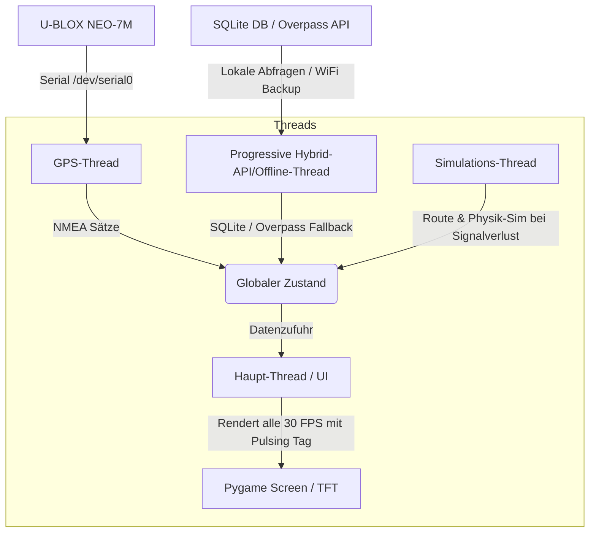

# Evans Co-Pilot Dashboard 🚗💨

> Ein interaktives, kindgerechtes Auto-Co-Pilot-Dashboard für den Raspberry Pi Zero WH, das aktuelle Geschwindigkeiten und Geschwindigkeitsbegrenzungen (via OpenStreetMap) visualisiert.

Dieses Projekt entstand für **Evan (geb. Juni 2021)**, um seine Faszination für Geschwindigkeiten und Tempolimits beim Autofahren spielerisch zu begleiten und die ständigen Fragen ("Wie schnell dürfen wir hier fahren?", "Wie schnell fahren wir gerade?") visuell und kindgerecht zu beantworten.

---

## 🌟 Features

*   **Große Live-Geschwindigkeit:** Gut lesbare Geschwindigkeitsanzeige im Zentrum des Displays mit dynamischem farblichem Feedback:
    *   🟢 **Grün:** Geschwindigkeit liegt im zulässigen Bereich.
    *   🟡 **Gelb:** Geringe Überschreitung (1-3 km/h über Limit).
    *   🔴 **Rot:** Überschreitung um mehr als 3 km/h.
*   **Tempolimit-Anzeige:** Klassisches europäisches Verkehrsschild (weißer Kreis mit rotem Rand), das das aktuelle Tempolimit anzeigt.
*   **Intelligente Schweizer Straßenerkennung:** Übersetzung von OpenStreetMap-Typen in kindgerechte Schweizer Begriffe (z.B. *Autobahn*, *Autostrasse*, *Kantonsstrasse*, *Gemeindestrasse*, *Quartierstrasse*, *Begegnungszone*, *Feldweg*) unter Einhaltung des Schweizer Rechtschreibstandards (Verwendung von Doppel-"ss" statt "ß").
*   **Progressive Hybrid-Offline-First Speed Engine (Schweiz):**
    *   *Lokale Hochleistungs-Datenbank:* Nutzt eine indizierte SQLite-Datenbank (`switzerland_roads.db`) mit über 600 MB Schweizer Straßennetzdaten, um Tempolimits und Straßennamen in Millisekunden komplett offline zu ermitteln.
    *   *Dynamische Progressive Radiussuche:* Sucht zuerst im nahen Umkreis (15m), und weitet die Suche bei Bedarf schrittweise aus (30m, 60m), um selbst bei komplexen Spuren, Abfahrten, Brücken oder kurzzeitigem GPS-Drift immer die präziseste Straße zu treffen.
    *   *Intelligentes Online-Fallback:* Falls offline kein Treffer erzielt wird, schaltet das System nahtlos auf die Live-Overpass-API um und puffert das Ergebnis.
*   **Automatischer GPS-Simulator (Marly-Route):**
    *   Sollte beim Starten oder im Betrieb kein Satellitensignal verfügbar sein (z.B. in der Garage, im Tunnel oder im dichten Wald), schaltet das System nach 10 Sekunden automatisch in den **Simulationsmodus**.
    *   Fährt eine realistische, dynamische Testroute durch Marly (Freiburg), simuliert realistische Beschleunigungs- und Bremsmanöver basierend auf den ermittelten Streckenlimits und aktualisiert Höhe sowie Himmelsrichtung.
    *   Sobald wieder ein echtes GPS-Signal empfangen wird, wechselt das System vollautomatisch zurück in den Live-Betrieb.
*   **High-Contrast Status-Tag ("SUCHE GPS" / "LIVE GPS" / "SIMULATOR"):**
    *   Ein wunderschöner, abgerundeter Status-Badge in der rechten oberen Ecke signalisiert auf einen Blick den aktuellen Zustand.
    *   *SUCHE GPS (Blau):* Ein pulsierender blauer Punkt zeigt an, dass nach einem validen Satelliten-Fix gesucht wird.
    *   *LIVE GPS (Grün):* Ein sanft pulsierender grüner Punkt, der wie ein Herzschlag schlägt, zeigt eine aktive, echte Satellitenverbindung.
    *   *SIMULATOR (Orange):* Ein hochkontrastiges, oranges Badge signalisiert den Simulationsbetrieb.
*   **Wetter, Uhrzeit & Datum (Open-Meteo):**
    *   Die große, gut ablesbare System-Uhrzeit zentriert das Dashboard.
    *   Automatischer Abruf lokaler Live-Wetterdaten über die kostenlose Open-Meteo-API (Temperatur und Unicode-Wettericons wie ☀️, ☁️, ☔) basierend auf den aktuellen GPS-Koordinaten. Vollständiges Offline-Fallback vorhanden.
*   **Zusatzanzeigen für kleine Forscher:**
    *   🛰️ **Satelliten-Verbindung:** Live-Anzahl der verbundenen Satelliten ("Sats: 8").
    *   🏔️ **Höhenmesser & Himmelsrichtung:** Aktuelle Höhe über dem Meeresspiegel (ideal für die hügelige und bergige Schweizer Landschaft) und die Himmelsrichtung (N, S, O, W).
*   **Volle Autonomie:** Startet extrem schnell und vollautomatisch direkt nach dem Booten (Headless, direkt in den Framebuffer).

---

## 🛠️ Hardware-Architektur

Das System läuft auf sehr kompakter, robuster Hardware und lässt sich ideal im Fond eines Autos (z.B. VW Passat) montieren:

*   **Zentraleinheit:** Raspberry Pi Zero WH (mit aufgelöteten GPIO-Pins).
*   **Display:** Offizielles [Adafruit 3.5" PiTFT](https://www.adafruit.com/product/2097) (320x480 Pixel, TFT-Treiber `HX8357D`).
*   **GPS-Empfänger:** U-BLOX NEO-7M GPS-Modul, angeschlossen über die serielle GPIO-Schnittstelle (`/dev/serial0`).
*   **Stromversorgung:** 5V USB-Stromversorgung über das Bordnetz des Fahrzeugs.

### Verkabelung des GPS-Moduls (U-BLOX NEO-7M)
Das GPS-Modul wird über den 40-Pin-Header des Raspberry Pi angeschlossen. Da das Adafruit PiTFT-Display die GPIOs 18, 19, 21, 22, 23, 24, 25 für SPI und Touch nutzt, bleiben die seriellen UART-Pins für das GPS-Modul frei:

| U-BLOX NEO-7M Pin | Raspberry Pi Pin | GPIO Name | Funktion |
| :--- | :--- | :--- | :--- |
| **VCC** | Pin 2 (oder 4) | 5V Power | Stromversorgung (5V) |
| **GND** | Pin 6 (oder 9, 14, 20) | Ground | Masse |
| **TX** | Pin 10 | GPIO 15 (RXD0) | Empfangskanal des Pi |
| **RX** | Pin 8 | GPIO 14 (TXD0) | Sendeleitung des Pi |

---

## 🏗️ Software-Architektur & Datenfluss

Die Applikation läuft unter **Raspberry Pi OS** (Debian Bookworm/Trixie) und ist vollständig in Python geschrieben. Sie nutzt Multithreading, um blockierungsfreie Updates zu garantieren:



1.  **GPS-Thread (`src/gps_reader.py`):** Liest kontinuierlich mit `pyserial` und `pynmea2` die seriellen NMEA-Sätze (`$GPRMC`, `$GPGGA` und `$GPGSV`) des GPS-Empfängers aus. Bei der Initialisierung werden proprietäre binäre UBX-Befehle (Automotive-Modus, AssistNow Autonomous AOP) direkt an den Chip geschickt und im NVRAM gespeichert, um den Kaltstart zu beschleunigen. `$GPGSV` (Satellites in View) liefert die Anzahl der sichtbaren Satelliten auch ohne gültigen Fix – ideal zur Diagnose des Empfangs.
2.  **Progressiver Hybrid-API/Offline-Thread (`src/osm_api.py`):** Ermittelt alle 10 Sekunden das Tempolimit (`maxspeed`) und den Straßentyp (`highway`). Er sucht zuerst progressiv in der lokalen SQLite-Datenbank (`switzerland_roads.db`) mit Radien von 15m, 30m und 60m. Findet er dort keinen Eintrag, greift er über das Hotspot-WLAN transparent auf die Live-Overpass-API zu.
3.  **Simulations-Thread (`src/main.py`):** Läuft im Hintergrund und simuliert eine fiktive Fahrt entlang einer Marly-Rundfahrtroute, sobald für mehr als 10 Sekunden kein echtes GPS-Signal detektiert wurde. Er rechnet realistische Trägheitsbeschleunigungen und Lenkwinkel ein.
4.  **UI-Thread (`src/ui.py`):** Rendert das Dashboard in Pygame und zeichnet es mit hoher Performance direkt auf das Display, inklusive des schlagenden "LIVE GPS"-Herzens oder der statischen "SIMULATOR"-Anzeige.

---

## 🚀 Installation & Einrichtung

### 1. Klonen und Virtual Environment einrichten
Klone das Repository auf deinem Raspberry Pi:

```bash
git clone https://github.com/nilsgollub/EvansDashboard.git
cd EvansDashboard

# Virtual Environment erstellen
python3 -m venv .venv
source .venv/bin/activate

# Abhängigkeiten installieren
pip install -r requirements.txt
```

### 2. UART/Serielle Schnittstelle aktivieren
Damit das GPS-Modul über `/dev/serial0` kommunizieren kann, muss die serielle Schnittstelle in `raspi-config` aktiviert werden:

1. Führe `sudo raspi-config` aus.
2. Navigiere zu: **Interface Options** -> **Serial Port**.
3. Wähle **No** bei "Would you like a login shell to be accessible over serial?".
4. Wähle **Yes** bei "Would you like the serial port hardware to be enabled?".
5. Beende und starte den Pi neu.

### 3. Display-Treiber (Adafruit PiTFT)
Das Display wird über die offiziellen Device-Tree Overlays konfiguriert. Füge folgenden Eintrag zu `/boot/firmware/config.txt` (bzw. `/boot/config.txt`) hinzu:

```ini
dtoverlay=pitft35-resistive,rotate=90,speed=32000000,fps=30
```

### 4. Autostart via Systemd (Autoboot in das Dashboard)
Um das Dashboard beim Einschalten des Autos automatisch ohne manuelles Login oder Desktop-Umgebung direkt zu booten, wird der mitgelieferte Systemd-Service `evans-dashboard.service` verwendet.

Kopiere den Service in den systemd-Pfad:

```bash
sudo cp evans-dashboard.service /etc/systemd/system/
sudo systemctl daemon-reload
sudo systemctl enable evans-dashboard.service
sudo systemctl start evans-dashboard.service
```

Der Service startet einen schlanken X-Server (`startx`), welcher wiederum über die Datei `~/.xinitrc` direkt unsere Python-Applikation im Kiosk-Modus lädt.

Die Datei `~/.xinitrc` in deinem Home-Verzeichnis (`/home/nilsgollub/.xinitrc`) sollte wie folgt aussehen, um bei jedem Neustart automatisch das neueste Update von GitHub zu ziehen:
```bash
cd ~/EvansDashboard
git fetch --all >> ~/git_pull.log 2>&1
git reset --hard origin/master >> ~/git_pull.log 2>&1
exec ~/.venv/bin/python -u src/main.py > ~/dashboard.log 2>&1
```

---

## 📶 Netzwerk-Konfiguration (NetworkManager / Bookworm)

Ab Raspberry Pi OS (Bookworm) wird standardmäßig **NetworkManager** anstelle von `wpa_supplicant` zur Netzwerksteuerung verwendet. Der automatische Wechsel (Failover) zwischen Heim-WLAN und Handy-Hotspot läuft damit vollautomatisch im Hintergrund.

### WLAN-Verbindungen einrichten und verwalten

1. **Heim-WLAN verbinden:**
   ```bash
   sudo nmcli device wifi connect "Skynet" password "DeinSkynetPasswort"
   ```
2. **Handy-Hotspot verbinden (als Fallback für unterwegs):**
   ```bash
   sudo nmcli device wifi connect "NiniHotspot" password "DeinHotspotPasswort"
   ```

### Wie funktioniert der automatische Wechsel?
Der NetworkManager speichert beide Verbindungen als Profile unter `/etc/NetworkManager/system-connections/` ab. Er wählt automatisch das stärkste bzw. das gerade verfügbare Netzwerk aus. Wenn du das Haus verlässt und das Heim-WLAN `Skynet` abbricht, verbindet sich der Pi automatisch mit dem Handy-Hotspot `NiniHotspot` (sofern dieser am Smartphone aktiv ist).

### Nützliche nmcli-Befehle zur Diagnose:
* **Verbindungsstatus anzeigen:** `nmcli connection show` (die aktive Verbindung ist grün markiert)
* **Verfügbare WLANs scannen:** `nmcli device wifi list` (zeigt die SSID und die Empfangsstärke an)
* **Gespeichertes Passwort im Klartext auslesen:** `sudo cat /etc/NetworkManager/system-connections/NiniHotspot.nmconnection`

---

---

## 🛠️ Fehlerbehebung & Logging

Um im laufenden Betrieb Fehler zu diagnostizieren, werden alle Ausgaben und Exceptions in der Datei `~/dashboard.log` protokolliert.

### Log-Datei live mitlesen:
```bash
tail -f ~/dashboard.log
```

### Typische Statusmeldungen im Log:
*   `[GPS] Erfolgreich verbunden auf /dev/serial0`: Die Hardwareverbindung zum GPS-Empfänger steht.
*   `[GPS] Suche nach Satelliten... (Noch kein GPS-Fix)`: Die Verbindung steht, aber es wird noch nach freier Sicht zum Himmel gesucht. Das ist im Haus normal und verschwindet nach wenigen Minuten unter freiem Himmel.
*   `[API] Frage Overpass API...`: Die Overpass-API wird erfolgreich abgefragt und gibt aktuelle Tempolimits zurück.

---

## 📜 Lizenz
Dieses Projekt ist für den privaten Gebrauch lizenziert.

*Viel Spaß auf der Straße, Evan!* 🏎️💨
